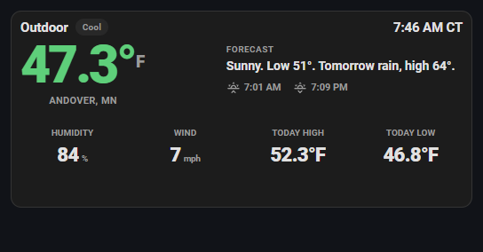
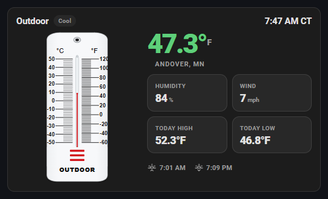
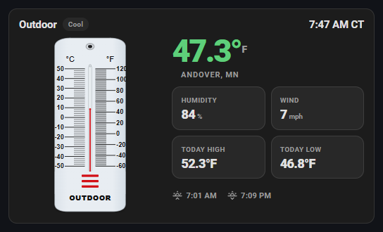
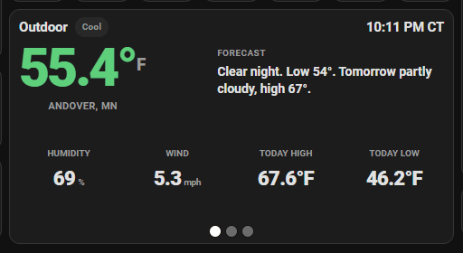
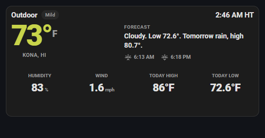
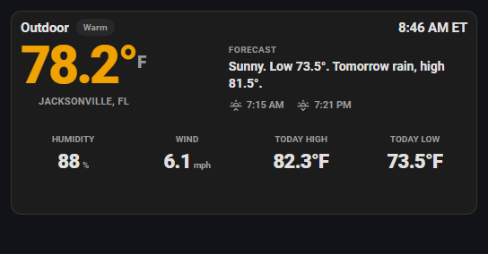
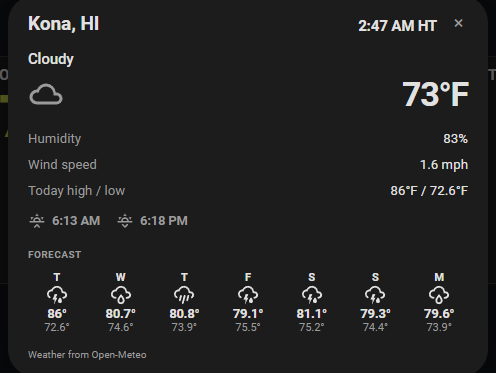
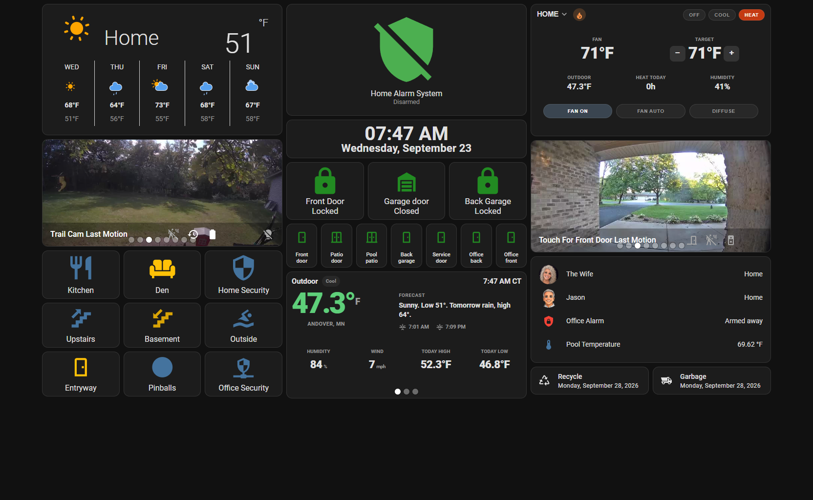

# Outdoor Temp Plus Card

[](https://github.com/hacs/integration)
[](https://my.home-assistant.io/redirect/hacs_repository/?owner=randrcomputers&repository=ha-outdoor-temp-card&category=plugin)
[](LICENSE)

Lovelace **outdoor thermometer** — not a thermostat. Use your backyard sensor at home, or any US **ZIP code** for another city. The big temperature changes color with the weather, the city sits under the number, and the upper-right corner shows that town’s local time (`9:38 PM CT`).



Home cards read a local `temperature` sensor (humidity optional) and `weather.forecast_home`. Remote cards need only `city` + `zip` — no extra Home Assistant weather integration. Tap a home card for the Forecast Home dialog; tap a ZIP city for that city’s forecast. The clock uses Home Assistant’s timezone at home, and the ZIP city’s timezone (Kona **HT**, Jacksonville **ET**).

## Looks

Pick a style in the visual editor (**Thermometer look**) or with `look:` in YAML.

| EZ-read plaque | Glass tube |
| :---: | :---: |
|  |  |
| `ezread` | `glass` |

| `look` | Editor label | Notes |
| --- | --- | --- |
| `ezread` | EZ-read plaque | White outdoor thermometer, °C left / °F right |
| `glass` | Glass tube | Same plaque, cooler glass tint |

The spirit column stays classic red. The big number goes ice blue when it’s freezing, yellow-green when mild, orange / red when it’s hot. Cool / Warm / Hot wording is a quiet gray chip.

## Activity Rotate Card

This card is built to live in an [Activity Rotate Card](https://github.com/randrcomputers/ha-activity-rotate-card). On a wall tablet it fits a **260px** slot. Use `compact: true` and `show_thermometer: false` so the plaque hides and the forecast layout fills the rotator.

Put **home + extra ZIP cities** on **Always show**. They flip while nothing else is running. Washer, dryer, pool, sprinklers, rain, and wind still take a turn when they match.



Home → Kona → Jacksonville. Each city shows its own clock (CT / HT / ET), real today high / low, and sunrise / sunset. Swipe or tap the dots to skip ahead.

| Home | Kona | Jacksonville |
| :---: | :---: | :---: |
|  |  |  |

Tap a ZIP city for that town’s week — not Forecast Home.



```yaml
type: custom:activity-rotate-card
interval: 10
height: 260
idle_card:
  type: custom:outdoor-temp-plus-card
  name: Outdoor
  look: ezread
  compact: true
  show_thermometer: false
  entity: sensor.outside_temp_and_humidity_temperature
  humidity_entity: sensor.outside_temp_and_humidity_humidity
  weather_entity: weather.forecast_home
cards:
  - always: true
    card:
      type: custom:outdoor-temp-plus-card
      name: Outdoor
      look: ezread
      compact: true
      show_thermometer: false
      entity: sensor.outside_temp_and_humidity_temperature
      humidity_entity: sensor.outside_temp_and_humidity_humidity
      weather_entity: weather.forecast_home
  - always: true
    card:
      type: custom:outdoor-temp-plus-card
      name: Outdoor
      compact: true
      show_thermometer: false
      city: Kona
      zip: "96740"
  - always: true
    card:
      type: custom:outdoor-temp-plus-card
      name: Outdoor
      compact: true
      show_thermometer: false
      city: Jacksonville
      zip: "32202"
```

Mark extra city cards **Always show**. If you only put them on the idle card, the rotator hides them as soon as anything else matches.

On a **narrow / phone** screen the plaque hides on its own (it clips) and the same forecast layout takes its place. Tablets keep the thermometer when `show_thermometer` is left on.



## Install

### HACS (recommended)

If HACS is already on your Home Assistant, click this button to open the repository and download it:

[](https://my.home-assistant.io/redirect/hacs_repository/?owner=randrcomputers&repository=ha-outdoor-temp-card&category=plugin)

Then **Download**, reload dashboard resources, and hard-refresh the browser (**Ctrl+F5**).

Or add it by hand: **HACS → Frontend → ⋮ → Custom repositories** →

```
https://github.com/randrcomputers/ha-outdoor-temp-card
```

Category: **Lovelace** / **Dashboard**

### Manual

1. Copy `outdoor-temp-plus-card.js` to `config/www/`
2. [](https://my.home-assistant.io/redirect/lovelace_resources/) → add `/local/outdoor-temp-plus-card.js` as a **JavaScript module**
3. Hard-refresh the browser (**Ctrl+F5**)

## Quick start

```yaml
type: custom:outdoor-temp-plus-card
name: Outdoor
look: ezread
entity: sensor.outside_temp_and_humidity_temperature
humidity_entity: sensor.outside_temp_and_humidity_humidity
weather_entity: weather.forecast_home
```

Any outdoor `temperature` sensor works. Humidity can be a matching `humidity` sensor on the same station. Leave both off and set `zip:` for a remote city.

Set **Card size** to **50%** in the editor, or `size: 50` in YAML, to shrink the whole card.

## What you see

| Area | Source |
| --- | --- |
| Red column | Live outdoor temperature (home sensor or ZIP weather) |
| **Mild** / **Hot** / **Freezing** badge | Derived from the live temperature (neutral chip, no color) |
| Big number | Live outdoor temperature (color follows the weather), with a small °F / °C |
| City | `city`, or the ZIP place name, or Home Assistant’s map location |
| Local time | Upper right, same size as the title — home TZ or the ZIP city’s clock |
| Forecast | Tonight + tomorrow from `weather_entity` or the ZIP forecast |
| Sunrise / sunset | Under the forecast — today’s times for that city (`mdi:weather-sunset-up` / `mdi:weather-sunset-down`) |
| Humidity | Local humidity sensor, or the ZIP weather |
| Wind | `weather_entity` or the ZIP weather |
| Today high / low | Recorder (home) or the ZIP daily forecast |
| History | Daily **high–low** stems for 7 / 14 / 30 days (home sensor) |
| Tap | Home → Forecast Home more-info. ZIP city → that city’s week |

History bars are **calendar days, midnight to midnight** in Home Assistant’s timezone.

## Options

All of these are in the visual editor. YAML names match the editor labels below.

| YAML | Editor | Required | Default | Description |
| --- | --- | --- | --- | --- |
| `look` | Thermometer look | no | `ezread` | `ezread` or `glass` — see **Looks** |
| `size` | Card size | no | `100` | Overall card scale: `100`, `75`, or `50` |
| `entity` | Outdoor temperature | no | — | Local `temperature` sensor. Leave off for a remote city / ZIP |
| `humidity_entity` | Outdoor humidity (optional) | no | — | `sensor` with device class **humidity** |
| `weather_entity` | Weather forecast (optional) | no | — | Home `weather` entity — wind plus the phone forecast |
| `city` | City name | no | Home town | Shown under the big temperature |
| `zip` | ZIP code | no | — | Another city (`96740` Kona, `32202` Jacksonville) |
| `name` | Card title | no | `Outdoor` | Header text |
| `unit_system` | Display units | no | `auto` | `auto`, `imperial` (°F), or `metric` (°C) |
| `history_days` | Default history range | no | `14` | `7`, `14`, or `30` |
| `show_history` | Show daily high / low history | no | `true` | Daily stem chart (home sensor) |
| `show_humidity` | Show humidity | no | `true` | Humidity reading |
| `show_feels` | Show heat-index when hot | no | `true` | Editor option; the compact row shows **Wind** |
| `show_thermometer` | Show thermometer plaque | no | `true` | Off = forecast layout on every screen |
| `show_sun` | Show sunrise / sunset | no | `true` | Times under the forecast, in that city’s timezone |
| `compact` | Compact (activity rotator) | no | `false` | Hides history and tightens the layout |

### Example with every option

```yaml
type: custom:outdoor-temp-plus-card
name: Outdoor
look: ezread
size: 100
entity: sensor.outside_temp_and_humidity_temperature
humidity_entity: sensor.outside_temp_and_humidity_humidity
weather_entity: weather.forecast_home
unit_system: imperial
history_days: 14
show_history: true
show_humidity: true
show_feels: true
show_thermometer: true
show_sun: true
compact: false
```

## Requirements

- Home Assistant **2024.1+**
- Recorder enabled for home today high / low and history
- A temperature sensor **or** a ZIP code. Humidity and a weather entity are optional.
- Optional: [Activity Rotate Card](https://github.com/randrcomputers/ha-activity-rotate-card) to flip cities and activities in one slot

## License

MIT — see [LICENSE](LICENSE).
